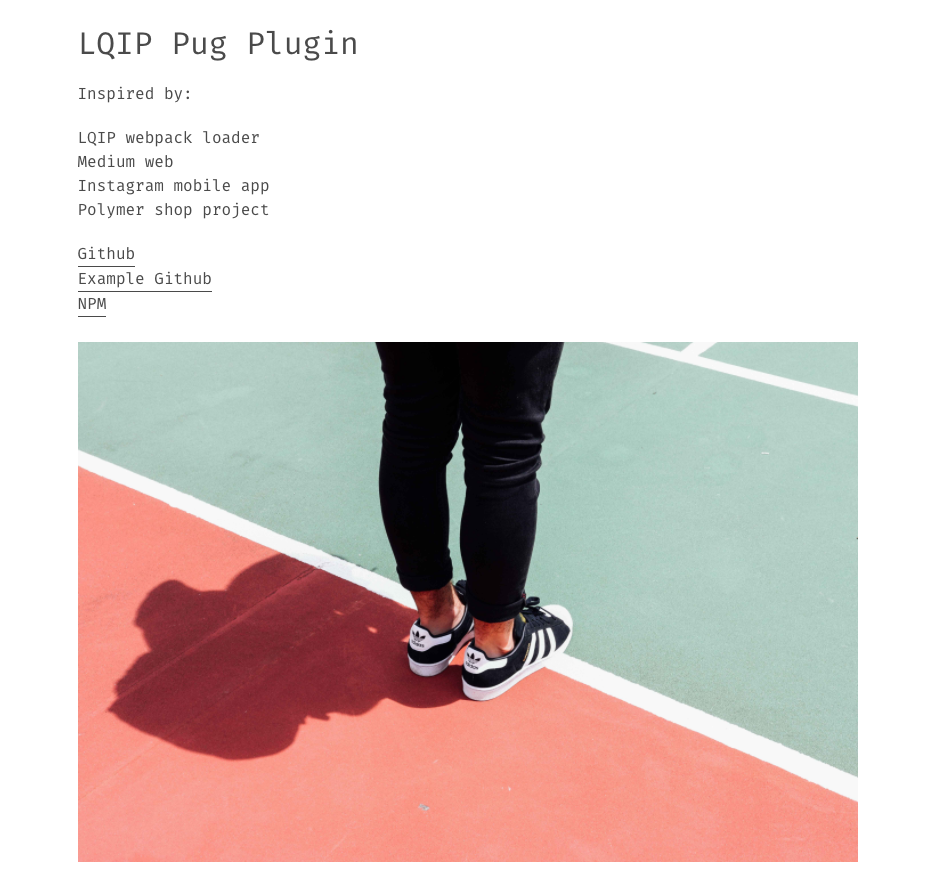

# LQIP Pug Plugin Example

[](https://mike3run.github.io/lazy-example/)

## Installing dependencies & running up
To work, the **Pixel2HTML Boilerplate** needs to install some dependencies to run the options you select.
For this job, run this command in your shell

```
$ npm run start
$ npm run code
```

### Other available npm commands

```
$ npm run build //build the project without serving
```

##### Generated with 💕 by Pixel2HTML v2.0.0 @ 2017-10-06T23:24:53-05:00
